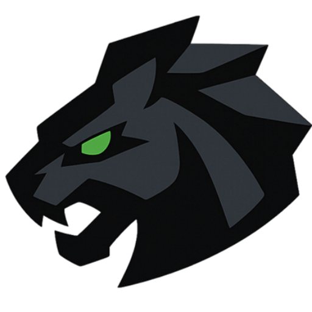
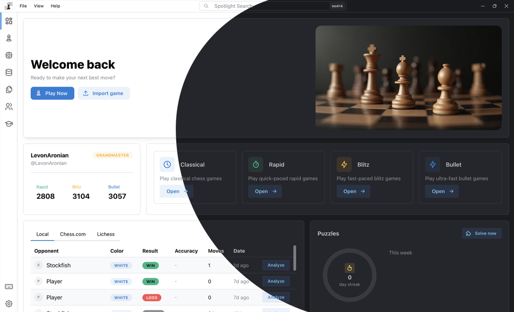
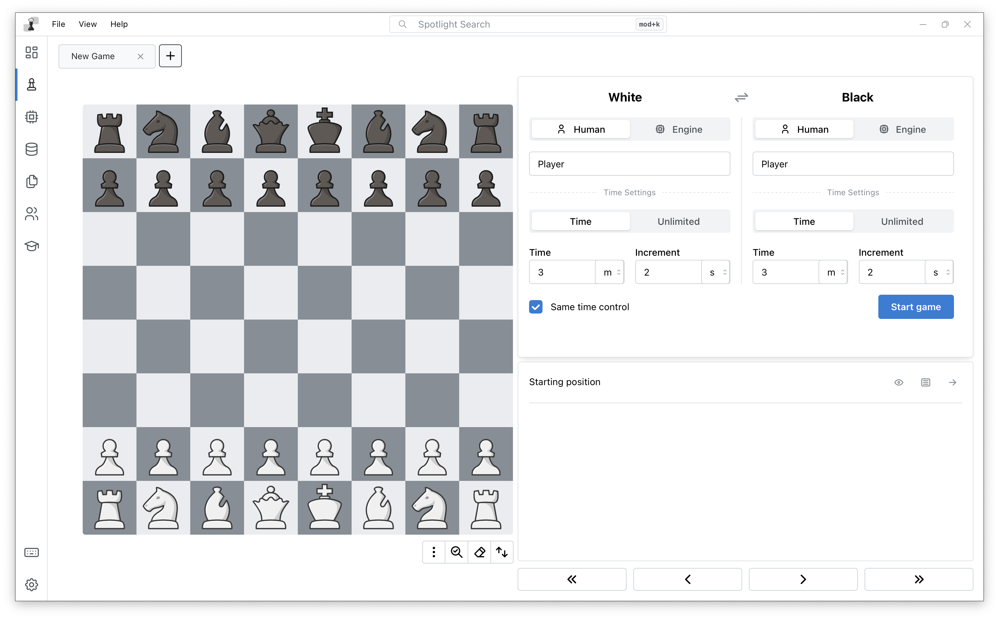
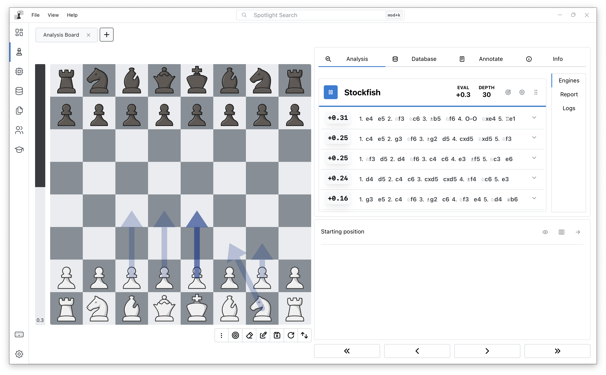
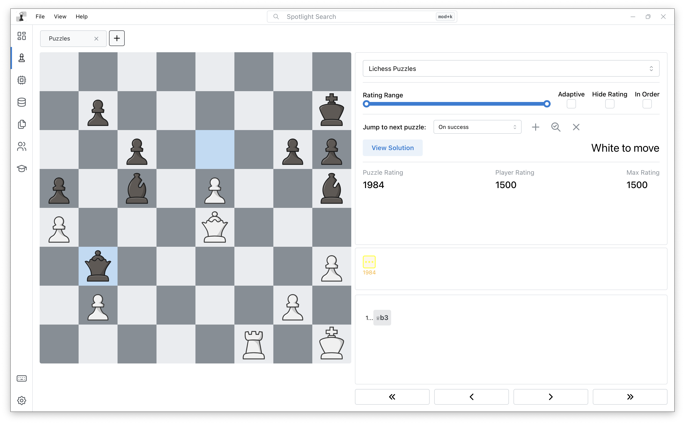
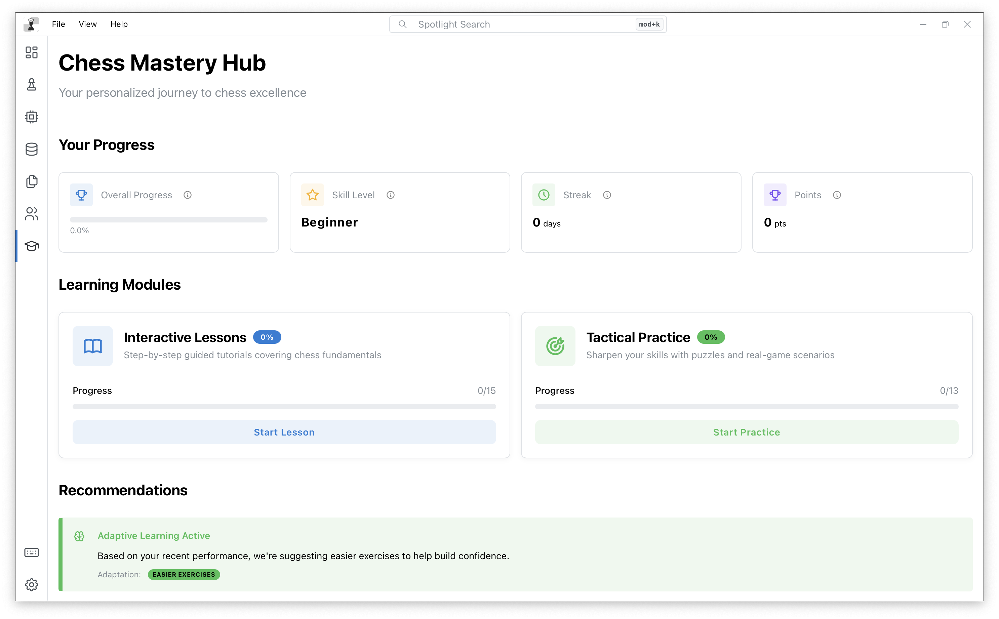
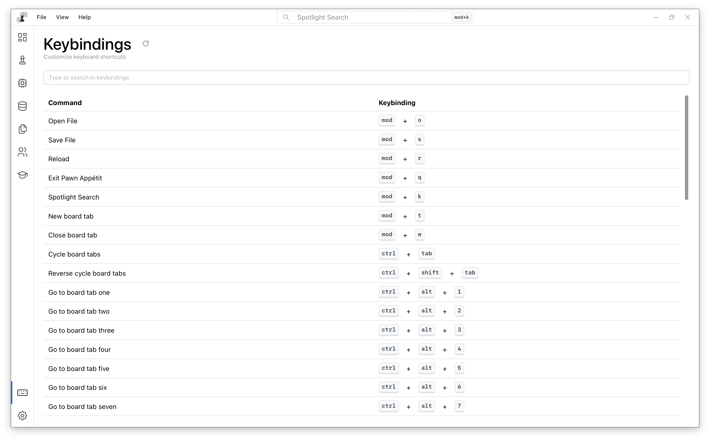
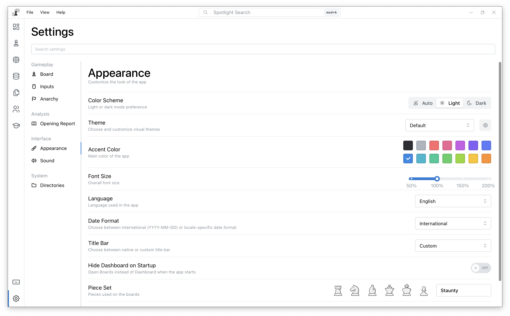

<div align="center">
<!-- Logo -->
<a href="https://github.com/luisrivasnoriega/Obsidian-Chess-Studio">

</a>

<!-- Title & Tagline -->
<h1 align="center">Obsidian Chess Studio</h1>

<div>
<a href="https://github.com/luisrivasnoriega/Obsidian-Chess-Studio/releases"><strong>Download</strong></a> •
<a href="https://github.com/luisrivasnoriega/Obsidian-Chess-Studio/discussions"><strong>Discussions</strong></a> •
<a href="https://github.com/luisrivasnoriega/Obsidian-Chess-Studio/issues"><strong>Issues</strong></a>
</div>

<br />

<div>
<!-- Build & Quality -->
<a href="https://github.com/luisrivasnoriega/Obsidian-Chess-Studio/actions/workflows/test.yml">

</a>
<a href="https://github.com/luisrivasnoriega/Obsidian-Chess-Studio/releases">

</a>
<a href="https://github.com/luisrivasnoriega/Obsidian-Chess-Studio/blob/main/LICENSE">

</a>
<!-- Downloads & Activity -->
<a href="https://github.com/luisrivasnoriega/Obsidian-Chess-Studio/releases">

</a>
<a href="https://github.com/luisrivasnoriega/Obsidian-Chess-Studio/stargazers">

</a>
<a href="https://github.com/luisrivasnoriega/Obsidian-Chess-Studio/network/members">

</a>
<a href="https://github.com/luisrivasnoriega/Obsidian-Chess-Studio/graphs/contributors">

</a>
<a href="https://github.com/luisrivasnoriega/Obsidian-Chess-Studio/discussions">

</a>
<a href="https://github.com/luisrivasnoriega/Obsidian-Chess-Studio/issues">

</a>


<!-- Platform & Tech -->
<a href="https://github.com/luisrivasnoriega/Obsidian-Chess-Studio#supported-platforms">

</a>
<a href="https://www.docker.com/">

</a>
</div>

<br />
<br />

<a href="./screenshots/banner.png" target="_blank">

</a>
<p>
<em>Experience professional chess analysis with an intuitive, modern interface</em>
</p>
</div>

## Overview

**Obsidian Chess Studio** is a comprehensive, open-source chess analysis platform that combines powerful engine integration, advanced game analysis, and intelligent training systems into a single, cross-platform application. Built with Rust and Tauri for exceptional performance and reliability, it delivers professional-grade tools for serious chess players, coaches, and enthusiasts.

The application provides deep game analysis with multi-engine support, automatic mistake detection, and detailed performance metrics. Its sophisticated database system enables exact and partial position searches across your entire game collection, while the opening repertoire trainer uses spaced repetition to help you master your chosen lines. Integrated player statistics from Lichess and Chess.com, pawn structure analysis, and an adaptive puzzle system complete a feature set that rivals commercial chess software—all while remaining completely free and open source.


## Table of Contents

- [Features](#features)
- [Screenshots](#screenshots)
- [Installation](#installation)
  - [Download](#download)
  - [Quick Start](#quick-start)
- [Development](#development)
  - [Prerequisites](#prerequisites)
  - [Building from Source](#building-from-source)
  - [Docker Build](#docker-build)
- [Comparison](#comparison)
- [Roadmap](#roadmap)
- [Contributing](#contributing)
- [Translations](#translations)
- [Community](#community)
- [Changelog](#changelog)
- [License](#license)
- [Acknowledgments](#acknowledgments)

## Features

### Feature Status Legend

> **Status Legend:** ✅ **Ready** | ⏳ **Work in Progress** | 🟡 **Partial** | 🔮 **Future**
>
> - ✅ **Ready**: Feature is fully implemented and available
> - ⏳ **Work in Progress**: Feature is currently being developed
> - 🟡 **Partial**: Feature is partially implemented with more work planned
> - 🔮 **Future**: Feature is planned for future releases


### 🎯 Core Features

#### Game Management
- ✅ Store and analyze games from Lichess.org and Chess.com
- ✅ Import games from PGN files
- ✅ Support for physical over-the-board games
- ✅ Automatic synchronization of online accounts
- ✅ Game history and favorites system

#### Multi-Engine Analysis
- ✅ Support for all UCI-compatible chess engines
- ✅ Simultaneous multi-engine analysis
- ✅ Real-time position evaluation
- ✅ Configurable depth and time controls
- ✅ Engine reordering and priority management
- ✅ Analysis logs and engine status monitoring
- ✅ Tablebase integration (Syzygy endgame databases)

#### Repertoire Training
- 🟡 Create and manage opening repertoires
- ✅ Automatic variant book generation from databases
- 🟡 Spaced repetition training system
- 🟡 Repertoire gap analysis (missing moves detection)
- ✅ Tree visualization of variations
- ✅ Repertoire statistics and coverage metrics

### 📊 Advanced Analysis

#### Deep Game Analysis
- ⏳ Automatic mistake detection and classification
- ⏳ Error categorization (tactical, positional, opening, etc.)
- ✅ Severity analysis (blunder, mistake, inaccuracy)
- ⏳ Thematic pattern detection
- ✅ Accuracy and ACPL (Average Centipawn Loss) calculation
- ✅ Estimated Elo rating based on performance
- ✅ Alternative move suggestions with centipawn gains

#### Player Statistics
- ✅ Multi-platform statistics (Lichess, Chess.com)
- ✅ Time control breakdown (bullet, blitz, rapid, classical)
- ✅ Opponent rating-based analysis
- ✅ Progress charts over time
- ✅ Opening performance statistics
- ✅ Pawn structure analysis
- ✅ Game results summary (won, draw, lost)
- ✅ Rating timeline visualization
- ✅ ELO domain and bucket analysis
- ✅ Monthly game distribution charts
- ⏳ Win/loss breakdown by game termination type (checkmate, timeout, resignation, stalemate)
- ⏳ Time management analysis (average time per move, time pressure patterns)
- ⏳ Performance by game phase (opening, middlegame, endgame)
- ⏳ Opening phase performance metrics
- ⏳ Middlegame performance analysis
- ⏳ Endgame performance and conversion rates
- ⏳ Phase transition analysis (opening to middlegame, middlegame to endgame)
- ⏳ Time control performance comparison
- ⏳ Rating progression by time control
- ⏳ Win rate trends over time
- ⏳ Draw rate analysis and patterns
- ⏳ Loss patterns and common mistakes
- ⏳ Streak tracking (winning/losing streaks)
- ⏳ Best and worst performance periods
- ⏳ Performance against different rating ranges
- ⏳ Color performance (white vs black statistics)
- ⏳ First move performance analysis
- ⏳ King safety evaluation
- ⏳ Piece development tracking
- ⏳ Space control metrics
- ⏳ Material advantage conversion rates
- ⏳ Positional evaluation trends

#### Pawn Structure Analysis
- ✅ Automatic pawn structure identification
- ✅ Frequency and win rate statistics
- ✅ Pawn structure visualization
- ✅ Island, isolated, doubled, and passed pawn analysis
- ✅ Structure-based game filtering

#### Opening Analysis
- ✅ ECO code classification
- ✅ Opening performance metrics
- ✅ Variation tree exploration
- ✅ Reference database comparison
- ⏳ Missing move detection in repertoires

### 🧩 Training & Learning

#### Puzzle System
- ✅ Adaptive puzzle difficulty based on player rating
- ✅ Custom Elo rating system for puzzles
- 🟡 Puzzle statistics and progress tracking
- 🟡 Streak tracking and achievements
- ✅ Puzzle database integration
- 🟡 Variant analysis in puzzles

#### Interactive Learning
- 🔮 Structured lessons from beginner to advanced
- 🔮 Adaptive practice exercises
- 🔮 Progress tracking with points and streaks
- 🔮 Intelligent recommendations based on performance
- 🔮 Adaptive difficulty adjustment
- 🔮 Multiple practice categories (tactical, positional, etc.)

### 👤 Profile Management

#### Multi-Profile System
- ✅ Create and manage multiple player profiles
- ✅ Link multiple online accounts (Lichess, Chess.com) to profiles
- ✅ Automatic game synchronization
- 🟡 FIDE ID integration for official data
- ✅ Per-profile database storage
- ✅ Session management for multiple game sessions

#### Account Integration
- ✅ Lichess account connection with OAuth
- ✅ Chess.com account integration
- ✅ Automatic game download and conversion
- ✅ Account statistics aggregation
- ✅ Cross-platform rating calculation

### 🔍 Search & Database

#### Position Search
- ✅ Exact position search by FEN
- ✅ Partial position search (material and configuration)
- ✅ Player-based filtering
- ✅ Opening-based filtering (ECO codes)
- ✅ Date range filtering
- ✅ Result-based filtering
- ✅ Rating-based filtering
- ✅ Fast cached searches

#### Game Database Features
- ⏳ Tournament management
- ⏳ Player database organization
- ✅ Game preview and detailed view
- ⏳ PGN import/export with annotations
- ✅ Database statistics and metrics

### 🎨 Customization

#### Visual Customization
- ✅ Multiple visual themes
- ✅ 30+ piece sets (alpha, cburnett, merida, staunty, etc.)
- ⏳ Customizable board styles
- ✅ Multiple sound sets (futuristic, lisp, nes, piano, robot, standard, woodland)
- ⏳ Customizable font sizes

#### Interface Options
- ✅ Fully customizable keyboard shortcuts
- ✅ Responsive layout (mobile and desktop)
- ✅ Multiple notation views (variations, repertoire, report)
- ✅ Multi-tab system for simultaneous boards
- ✅ Context menus and tooltips

### 🛠️ Additional Features

#### Game Import/Export
- ✅ PGN file import
- ✅ Lichess game import
- ✅ Chess.com game import
- ✅ PGN export with full annotations
- ✅ Batch import/export operations

#### Analysis Tools
- ✅ Variant analysis with multiple lines
- ✅ Best move suggestions
- ✅ Position evaluation graphs
- ✅ Move annotations (!!, !, !?, ?!, ?, ??)
- ✅ Game reports with detailed analysis

#### Play Features
- ⏳ Play against engines with configurable strength
- ✅ Analysis mode for deep position study
- ✅ Game notation and move history
- ✅ Time control support

#### Technical Features
- ✅ Cross-platform (Windows, macOS, Linux)
- ✅ High-performance Rust backend
- ✅ Modern React/TypeScript frontend
- ✅ Efficient SQLite storage
- ✅ Advanced indexing for fast searches
- ✅ Caching system for frequent queries
- ✅ Chess960 (Fischer Random) support

## Screenshots

<div>

<em>Play chess games and analyze them with powerful engine tools</em>

[](./screenshots/play-game.png)
[](./screenshots/analyze-game.png)  

---

<em>Solve puzzles and improve with guided learning</em>

[](./screenshots/solve-puzzle.png)
[](./screenshots/learn.png)  

---

<em>Flexible keybindings and appearance settings</em>

[](./screenshots/keybindings.png)
[](./screenshots/settings-appearance.png)  

</div>

## Installation

### Download

Prebuilt binaries are available for Windows, macOS, and Linux: 
 
**[Download the latest release](https://github.com/luisrivasnoriega/Obsidian-Chess-Studio/releases/latest)** 
 
| Platform | Download | 
|----------|----------| 
| **Windows** | `.exe` | 
| **macOS** | `.dmg` (Apple Silicon and Intel) | 
| **Linux** | `.AppImage`, `.deb`, or `.rpm` | 
| **Android (Direct APK)** | `.apk` (if available) |

#### Android (Direct APK) Updates

If you install the app via a direct `.apk` (not via an app store), the Android build can update by downloading the latest `.apk` attached to the GitHub Release (an asset ending in `.apk`) and then opening the system installer. Android may require enabling "Install unknown apps" for Obsidian Chess Studio.
 
### Quick Start 

1. Download and install Obsidian Chess Studio for your platform
2. Launch the application
3. Import a game from Lichess or Chess.com (or load a PGN file)
4. Start analyzing with the built-in Stockfish engine
5. Use GitHub Issues/Discussions for support and feedback


## Development

### Prerequisites
Ensure you have the required tools installed for your platform:
- [Tauri prerequisites](https://tauri.app/start/prerequisites/)
- [pnpm package manager](https://pnpm.io/)

### Building from Source

1. **Clone the repository**:

   ```bash
   git clone git@github.com:luisrivasnoriega/Obsidian-Chess-Studio.git
   cd Obsidian-Chess-Studio
   ```

2. **Install dependencies using pnpm**:

   ```bash
   pnpm install
   ```

3. **Run in Development Mode**:

    Build and run the desktop application using Tauri:

    ```bash
    pnpm tauri dev
    ```

4. **Build for Production**:

    Build the application for production:

    ```bash
    pnpm tauri build
    ```

    The compiled application will be available at:

    ```bash
    src-tauri/target/release
    ```

### Docker Build

You can also build Obsidian Chess Studio using Docker (make sure [Docker](https://www.docker.com/) is installed and running):

1. **Build the Docker image**:

   ```bash
   docker build -t obsidian-chess-studio .
   ```

2. **Run the container**:

   ```bash
   docker run -d --name obsidian-chess-studio-app obsidian-chess-studio
   ```

3. **Copy the built binary from the container**:

   ```bash
   docker cp obsidian-chess-studio-app:/output/obsidian-chess-studio ./obsidian-chess-studio
   ```

The binary will be available in your current directory.

## Test Coverage

Obsidian Chess Studio maintains comprehensive test coverage across both the frontend (React/TypeScript) and backend (Rust) codebases to ensure reliability and code quality.

### Frontend Test Coverage

The frontend test suite uses **Vitest** with v8 coverage instrumentation. Current coverage metrics:

| Metric | Coverage |
|--------|----------|
| **Statements** | 22.64% |
| **Branches** | 15.27% |
| **Functions** | 17.31% |
| **Lines** | 23.89% |

**Test Statistics:**
- ✅ **177 test files** passing
- ✅ **311 tests** passing
- ⏱️ Test execution time: ~0 seconds

**Well-Tested Areas:**
- **Profile Components** (92.59% coverage): Player profiles, account selectors, personal cards, and panel components
- **Utility Functions** (87.5% coverage): i18n configuration, chess engine utilities, formatters, and environment detection
- **Chess Utilities** (96.63% coverage): Chess engine integration and management
- **Component Testing**: Comprehensive React component tests with proper mocking and user interaction simulation

**Areas for Improvement:**
- File utilities and opening management (lower coverage)
- State management stores (tree, database views)
- Some utility modules (tabs, storage, logger)

### Backend Test Coverage

The Rust backend uses **Cargo's built-in test framework** with comprehensive unit and integration tests.

**Test Statistics:**
- ✅ **234 tests** passing
- ⏱️ Test execution time: ~3.44 seconds

- ⏸️ 2 stress tests ignored (performance benchmarks)

**Well-Tested Modules:**
- **Database Operations**: Player statistics, game filtering, search functionality
- **Position Search**: Exact and partial position matching, FEN parsing, board hashing
- **PGN Processing**: Game parsing, reading, writing, and offset management
- **Pawn Structure Analysis**: Structure extraction, signature generation, filtering
- **Opening Management**: Opening classification, ECO code matching, variation handling
- **Puzzle System**: Puzzle retrieval, filtering, caching, and validation
- **Error Handling**: Comprehensive error type coverage with proper serialization
- **File System Operations**: Archive extraction, URL validation, file management
- **FIDE Integration**: Player lookup, XML parsing, photo handling
- **Variant Positions**: Position storage, retrieval, and migration

**Test Categories:**
- Unit tests for individual functions and modules
- Integration tests for database operations
- Edge case handling (invalid inputs, empty data, boundary conditions)
- Error path testing (malformed data, missing files, invalid configurations)

### Running Tests

**Frontend Tests:**
```bash
# Run all tests
pnpm test

# Run tests with coverage
pnpm vitest run --coverage
```

**Backend Tests:**
```bash
# Run all Rust tests
cd src-tauri
cargo test

# Run tests with output
cargo test -- --nocapture

# Run specific test module
cargo test db::player_stats::tests
```

### Continuous Integration

Tests are automatically run on every commit and pull request via GitHub Actions, ensuring code quality and preventing regressions.

## Comparison

| Feature | Obsidian Chess Studio | ChessBase | Arena | Scid |
|---------|------------------------|----------|-------|------|
| **Price** | Free ✅ | Paid ❌ | Free ✅ | Free ✅ |
| **Modern UI** | ✅ | 🟡 | ❌ | ❌ |
| **Cross-platform (Desktop)** | ✅ | Windows only ❌ | Windows only ❌ | ✅ |
| **Mobile App** | ⏳ WIP | ✅ | ❌ | ❌ |
| **Cloud Sync (async)** | 🔮 Planned | ✅ | ❌ | ❌ |
| **Open Source** | ✅ | ❌ | ❌ | ✅ |
| **Downloadable Databases (multi-GB)** | ✅ | ✅ | 🟡 | 🟡 |
| **Multi-Engine Analysis (simultaneous)** | ✅ | ✅ | 🟡 | 🟡 |
| **Online Account Sync (Lichess/Chess.com)** | ✅ | 🟡 | ❌ | ❌ |
| **Tablebases** | ✅ | 🟡 | 🟡 | 🟡 |


This comparison uses *current premium versions* (e.g., ChessBase ’26) and focuses on the workflow OCS targets: modern UX, cross-platform, large downloadable databases, and multi-engine analysis.

### Obsidian Chess Studio (OCS)
- **Price:** Free ✅
- **License:** Open Source ✅
- **Modern UI:** ✅
- **Cross-platform (Desktop):** ✅
- **Downloadable content:** Multiple **very large databases** (multi-GB) ✅
- **Engines:** Multiple engines (analysis/play) ✅

### ChessBase ’26 Premium Package
- **Price:** Paid ❌ (≈ €499.90)
- **What you get (bundle):**
  - ChessBase ’26 program
  - 1-year Premium membership
  - Mega Database 2026
  - Corr Database 2026
  - Update Service through 31.12.2026 (≈ 5,000 games/week)
  - ChessBase Magazine (digital)
- **Cross-platform (Desktop):** Windows only ❌
- **Engines:** Strong engine integration (multi-engine via UCI) ✅

### Arena
- **Price:** Free ✅
- **License:** Freeware (not Open Source) ⚠️
- **Cross-platform (Desktop):** Windows only ❌
- **Engines:** UCI + WinBoard engine support ✅
- **Modern UI:** ❌

### Scid vs. PC
- **Price:** Free ✅
- **License:** Open Source ✅
- **Cross-platform (Desktop):** ✅
- **Engines:** UCI engine support ✅
- **Modern UI:** ❌

## Roadmap

- [ ] **Mobile App (WIP)**
- [ ] **Cloud Sync**

## Contributing

We welcome contributions of all kinds:

- **Code** - See [CONTRIBUTING.md](./CONTRIBUTING.md) for development guidelines
- **Translations** - Help localize the app (see [Translations](#translations) section below)
- **Bug Reports** - Open an [issue](https://github.com/luisrivasnoriega/Obsidian-Chess-Studio/issues)
- **Feature Requests** - Start a [discussion](https://github.com/luisrivasnoriega/Obsidian-Chess-Studio/discussions)
- **Star this repo** - It really helps us grow!

### Translations

Obsidian Chess Studio is for chess players **all around the world**! We're committed to making professional-grade chess analysis accessible in your language. Join our growing international community and help us reach **every chess player**, no matter where they are.

<!-- TRANSLATIONS_START -->
| Language  | Progress   | Link                        |
|-----------|----------|-----------------------------|
| 🇺🇸 **English US** | ✅ 100% | [View](./src/locales/en-US) |
| 🇪🇸 **Español (Spanish)** | 🟡 99% | [View](./src/locales/es) |
| 🇧🇾 **Беларуская (Belarusian)** | 🟡 73% | [View](./src/locales/be) |
| 🇩🇪 **Deutsch (German)** | 🟡 73% | [View](./src/locales/de) |
| 🇬🇧 **English UK** | 🟡 73% | [View](./src/locales/en-GB) |
| 🇫🇷 **Français (French)** | 🟡 73% | [View](./src/locales/fr) |
| 🇦🇲 **Հայերեն (Armenian)** | 🟡 73% | [View](./src/locales/hy) |
| 🇮🇹 **Italiano (Italian)** | 🟡 73% | [View](./src/locales/it) |
| 🇯🇵 **日本語 (Japanese)** | 🟡 73% | [View](./src/locales/ja) |
| 🇳🇴 **Norsk (Norwegian Bokmål)** | 🟡 73% | [View](./src/locales/nb) |
| 🇵🇱 **Polski (Polish)** | 🟡 73% | [View](./src/locales/pl) |
| 🇵🇹 **Português (Portuguese)** | 🟡 73% | [View](./src/locales/pt) |
| 🇷🇺 **Русский (Russian)** | 🟡 73% | [View](./src/locales/ru) |
| 🇺🇦 **Українська (Ukrainian)** | 🟡 73% | [View](./src/locales/uk) |
| 🇨🇳 **中文 (Chinese)** | 🟡 73% | [View](./src/locales/zh) |
| 🇸🇦 **العربية (Arabic)** | 🟡 70% | [View](./src/locales/ar) |
| 🇹🇷 **Türkçe (Turkish)** | 🟡 56% | [View](./src/locales/tr) |
<!-- TRANSLATIONS_END -->

Want to help translate? See [CONTRIBUTING.md](./CONTRIBUTING.md).

## Changelog

For a list of recent changes, see the [Changelog](./CHANGELOG.md).

## License

Obsidian Chess Studio is licensed under the [GPL-3.0 License](./LICENSE).

## Acknowledgments

Special thanks to all contributors and the chess programming community.
